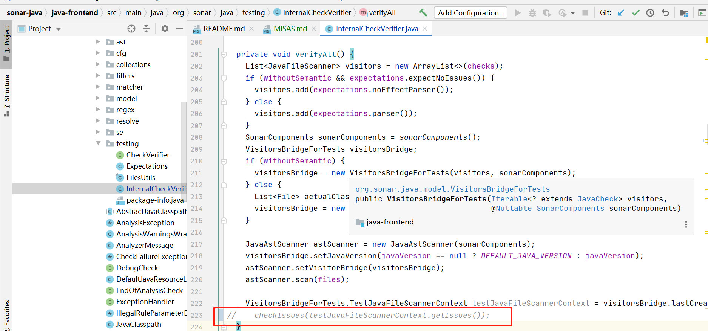
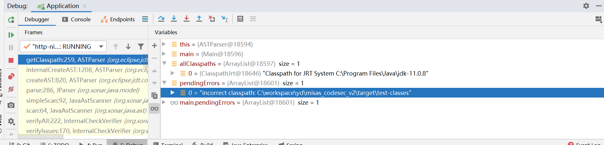
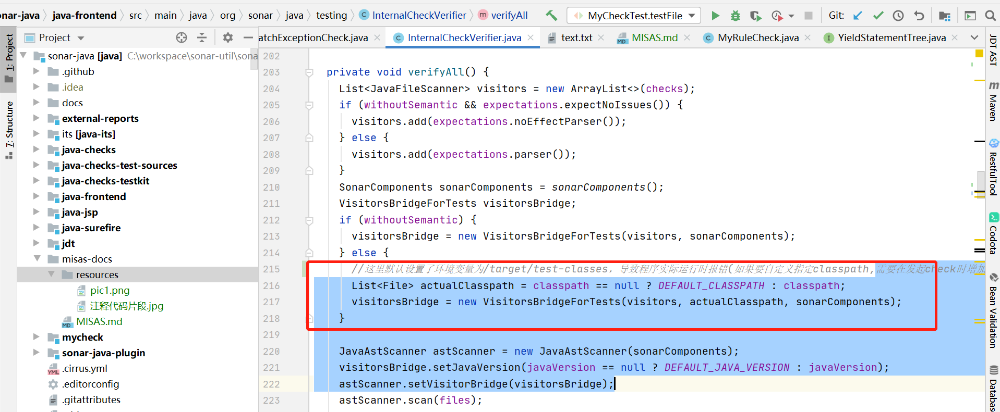
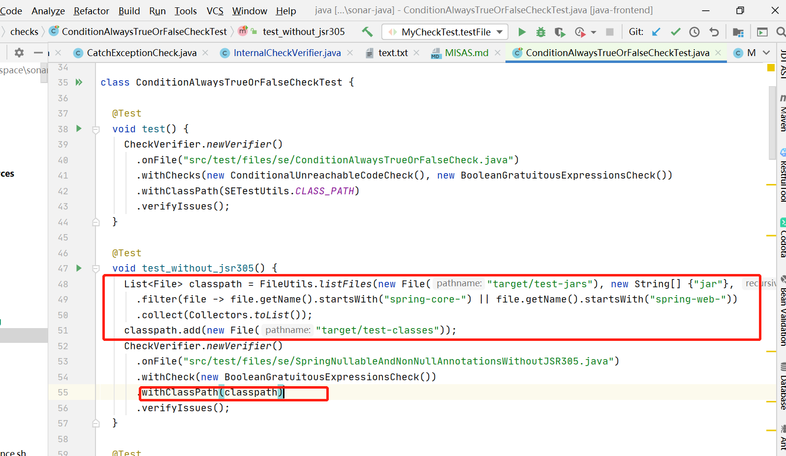

###对于代码的改造
1. java-fronted模块注释了以下代码

我们只需要生成AST抽象语法树,以及对AST树进行分析即可。不需要对issues进行进一步校验的功能


###如何使用
1. 打包命令

```mvn clean package -Dmaven.test.skip=true```

2. 找到java-fronted模块,target文件夹下生成的jar包,执行一下命令导入本地maven仓库
```mvn install:install-file -Dfile=本地jar包存放目录 -DgroupId=org.sonarsource.java -DartifactId=java-frontend -Dversion=6.8.0-SNAPSHOT -Dpackaging=jar```


###遇到的问题
1. 程序执行报错“invalid environment settings”

经过查看代码发现,如果在发起检测时没有指定classpath,那么程序会默认设置/target/test-classes,这种情况下程序如果本身不存在此路径的话,就会报错




自定义classpath示例


